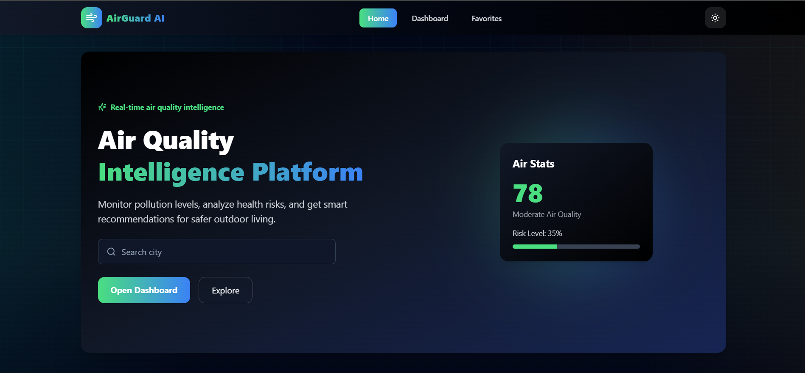
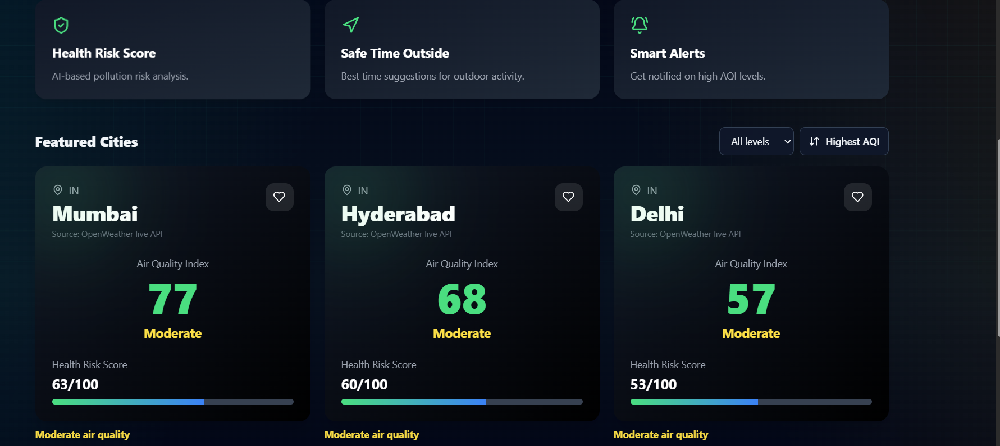
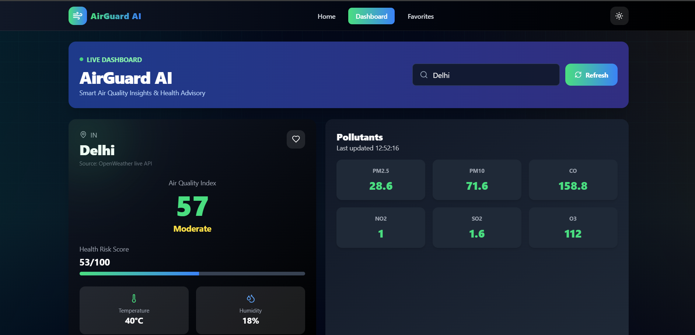
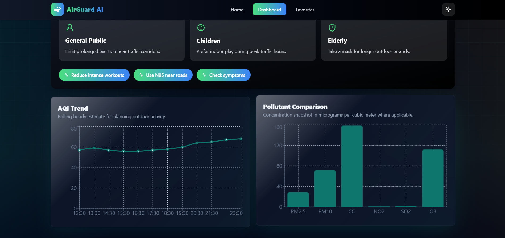
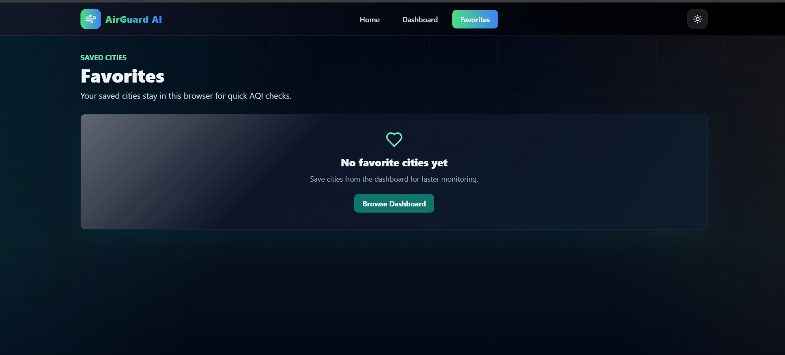

# AirGuard AI – Smart Air Quality Insights & Health Advisory Platform

## Problem Statement

Existing air quality platforms often present complex AQI data that is difficult for common users to understand. This project addresses that gap by converting raw environmental data into simple insights and actionable recommendations, especially for vulnerable groups such as children and elderly individuals.

---

## Overview

AirGuard AI is a web application designed to simplify air quality data and present it in a meaningful and user-friendly way. Instead of displaying only raw AQI values, it provides clear insights, health recommendations, and visual analytics to help users make informed daily decisions.

---

## Key Features

* City-based AQI dashboard with real-time data
* Detailed pollutant analysis (PM2.5, PM10, CO, NO₂, SO₂, O₃)
* Interactive charts for AQI trends and pollutant comparison
* Health advisory panel for different user groups
* Custom health risk score based on AQI and conditions
* Safe time recommendation for outdoor activities
* Search and filter functionality for cities
* Dark mode with persistent settings
* Favorite cities feature
* Auto-refresh every 5 minutes
* Responsive and optimized user interface

---

## Tech Stack

* React (Vite)
* JavaScript (ES6+)
* Redux Toolkit
* React Router
* Axios
* Tailwind CSS
* Recharts
* OpenWeather API
* Vercel / Netlify (Deployment)

---

## Project Structure

src/
components/
pages/
services/
store/
slices/
utils/

---

## Setup Instructions

```bash
npm install
npm run dev
```

Open the local server URL provided by Vite.

---

## Environment Variables

Create a `.env` file and add:

```bash
VITE_OPENWEATHER_API_KEY=your_api_key_here
```

If the API key is not provided, the application will use fallback demo data.

---

## Build and Preview

```bash
npm run build
npm run preview
```

---

## Deployment

### Vercel

1. Push the project to GitHub
2. Import the repository in Vercel
3. Add environment variables
4. Deploy

### Netlify

1. Connect the GitHub repository
2. Set build command: npm run build
3. Set publish directory: dist

---

## Screenshots

## Screenshots

### Home Page




### Dashboard




### Favorites



---

## Unique Value

* Converts complex AQI data into simple insights
* Provides health-focused recommendations
* Improves user understanding instead of showing raw data
* Clean and responsive user interface

---

## Author

**Name:** Yash Verma
**Roll Number:** 2501730159

---

## Conclusion

AirGuard AI bridges the gap between environmental data and user awareness by providing a smart and intuitive air quality monitoring platform.
